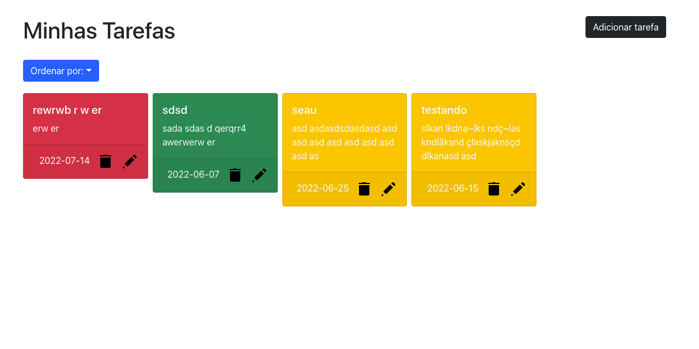

## Projeto TO-DO-LIST

### Contexto

Foi desenvolvido um sistema capaz de auxiliar as pessoas colaboradoras a se organizar e ter mais produtividade, nele é possivel inserir, remover e atualizar uma nova tarefa, visualizar a lista de tarefas a mesma pode ser ordenada por ordem alfabética, data de criação ou por status.

### Tecnologias usadas

>ReactJs, NodeJs, Express, MySql, Context-API, Hooks, JavaScript, HTML, CSS, Bootstrap.

### Instalação do projeto

1. Clone o link do repositório: ```git clone git@github.com:esaumatias/TO-DO-LIST.git```
2. Abra o diretório backend e siga as instruções;
3. Depois abra o diretório frontend e siga as instruções;

### Configurações para o teste

1. Crie um banco de dados para os testes no MySql com o seguinte código:

  ``````  
    CREATE DATABASE IF NOT EXISTS test_api;

    USE test_api;

    CREATE TABLE IF NOT EXISTS  tasks
    (
        id INT NOT NULL AUTO_INCREMENT,
        title VARCHAR(30) NOT NULL,
        tasks VARCHAR(200) NOT NULL,
        date VARCHAR(50) NOT NULL,
        status VARCHAR(30) NOT NULL,
        PRIMARY KEY(id)```
    );
    
   ``````

2. Iniciar o testes: ```npm test```



